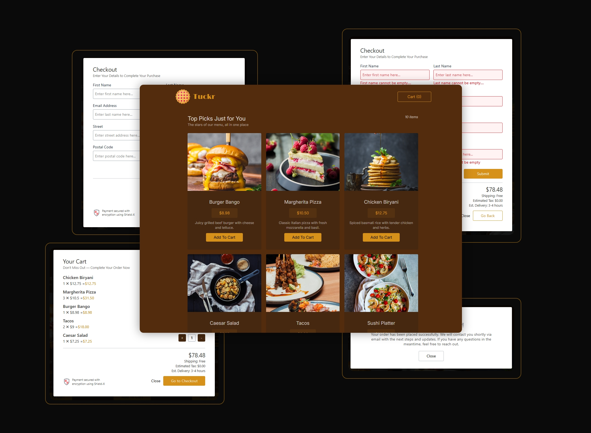

# Tuckr 🍽️

Tuckr is a modern food ordering app built with React, designed for a seamless and intuitive user experience. Users can browse a curated list of available food items and add selections to their cart with a single click. The cart provides detailed information on each item, along with the ability to adjust quantities as needed. Upon proceeding to checkout, users are prompted to enter personal details such as name and address. Once submitted, the order is saved securely to the backend, and a confirmation message is displayed, completing the fast, convenient, and reliable food ordering process.

The frontend of Tuckr is developed using React 19, leveraging its latest features for a responsive and efficient UI. On the backend, the app is powered by FastAPI, ensuring high-performance and scalable request handling. Together, these technologies provide a robust foundation for a smooth and modern food ordering experience.



This project also includes a backend powered by Python's FastAPI, which you can find [here](https://github.com/ummamali/tuckrbck).


## Features ✨

- **Browse Menu**  
  View a dynamic list of available food items with names, images, and prices.

- **Add to Cart**  
  Instantly add selected food items to your cart with a single click.

- **Cart Management**  
  View detailed item summaries in the cart and adjust quantities as needed.

- **Secure Checkout**  
  Enter personal information like name and address to finalize your order.

- **Order Creation**  
  Create and submit orders that are saved in the backend database.

- **Success Confirmation**  
  Receive a clear confirmation message once your order is successfully placed.

## Installation  

Follow these steps to set up and run the Project Manager app locally (Make sure you have Node.js and npm installed before running the commands):  

1. **Clone the repository:**  

    ```sh
   git clone https://github.com/Ummamali/tuckr.git
   cd tuckr

3. **Install dependencies:**

      ```sh
    npm install
    
4. **Start the development server:**

     ```sh
     npm run dev

## Technologies Used ⚙️

- **HTML5** – HTML5 is the foundation of the app's structure, providing the semantic layout and supporting multimedia elements. It ensures that the content is accessible and well-organized across all modern browsers.
  
- **CSS3** – CSS3 is used for styling the app, creating a visually appealing design with modern features like flexbox, animations, and responsive layouts. It enhances the user experience by ensuring that the interface is aesthetically pleasing.

- **JavaScript** – JavaScript is the primary programming language driving the functionality of the app, handling user interactions, and managing dynamic content. It powers the quiz logic, including question navigation and score calculation.

- **React** – React is used to build the app’s user interface with reusable components, allowing for a dynamic and responsive experience. Its virtual DOM ensures optimal performance by efficiently updating the UI when the state changes.

- **Vite** – Vite is a next-generation build tool that is used to bundle the app. It provides fast development with features like hot module replacement (HMR), making the development process faster and more efficient.

- **TailwindCSS** – TailwindCSS is a utility-first CSS framework used to create custom, responsive designs quickly. It simplifies the styling process by providing a wide range of pre-built classes that can be combined to create any layout.

- **Node.js** – Node.js allows the backend of the app to handle server-side logic and file parsing. It enables the app to process quiz files, manage requests, and serve dynamic content efficiently.

- **Git** – Git is a version control system that tracks code changes, facilitates collaboration, and ensures that developers can work on different parts of the project without conflicts. It is essential for maintaining a smooth development workflow.

### Custom Hook: `useValidator`

Tuckr includes a custom React hook called `useValidator` that simplifies input validation using YUP schemas. You can pass an object containing YUP-based validators, and the hook will manage validation state—marking each field as valid or invalid accordingly. It supports both synchronous and asynchronous validation, with the flexibility to trigger validation on blur or on every keystroke. Additionally, it offers input debouncing to enhance performance and user experience, especially for real-time validation in forms like checkout.

### Form Handling with React 19 Form Actions

Tuckr leverages React 19's new Form Actions API to streamline form management. This includes the `useActionState` and `useFormStatus` hooks, which simplify handling form submissions, validations, and asynchronous states.

- **`useActionState`**  
  Manages the state of form actions, allowing for cleaner handling of form submissions and responses without manual state management. It provides access to the current state, a function to trigger the action, and a pending status indicator. :contentReference[oaicite:0]{index=0}

- **`useFormStatus`**  
  Offers real-time status of form submissions, such as pending states, enabling components to respond accordingly (e.g., disabling submit buttons during submission).

By integrating these hooks, Tuckr ensures a more declarative and efficient form handling experience, reducing boilerplate code and enhancing user interactions.


## License  

This project is licensed under the **MIT License**. For more details, visit [MIT License](https://opensource.org/licenses/MIT).  
